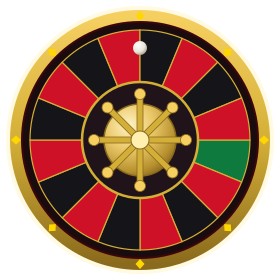
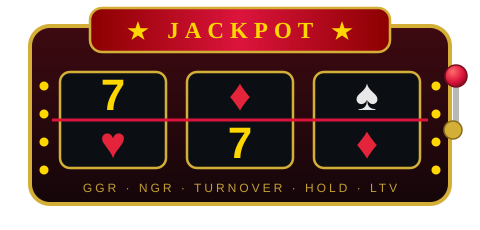

  

---

## ♠️ O Arquiteto da Casa

> *"Eu arquiteto sistemas à frente do seu tempo — onde a tecnologia desaparece, a complexidade se dissolve e as ideias, em silêncio, redesenham o futuro."*

* 🎰 **Especialista em Desenvolvimento de Software @ F12 do Brasil** — plataformas de iGaming orientadas a performance, qualidade, UX e conversão
* 👑 **Sócio @ RoyalVipClub** — rede social gamificada de iGaming
* 🏛️ **Arquitetura de Software** — monolitos modulares, microsserviços, sistemas distribuídos, SOLID e Clean Code como regra da casa
* 🎲 Transformo dados em decisão: KPIs, funis, retenção, engajamento e CRO
* 📍 Recife, Pernambuco — Brasil

---

## 🎲 Mesa de Especialidades · Domínio iGaming

🎡 *A roda gira. A margem é da casa.*

| 🎯 Área | ♟️ O que entrego |
|---|---|
| **Matemática de apostas** | Odds, margem/overround, risco e exposição |
| **Gamificação & Retenção** | Missões, níveis, recompensas, streaks, economia de pontos |
| **Dados & KPIs** | GGR · NGR · Turnover · Hold · LTV — funis de conversão e CRO |
| **CRM & Growth** | Segmentação, campanhas, bônus e cashback orientados a dados |
| **Pagamentos & Compliance** | PIX, KYC, antifraude, LGPD |
| **Plataforma** | Multi-tenant, alta concorrência, consistência transacional (wallet ACID) |

---

## 🃏 Stack — As Cartas na Manga

**Linguagens**

   

**Frontend & Mobile**

 

**Backend, Dados & Infra**

   

---

## 👑 Trajetória — Mão Atual & Histórico

| | Casa | Cargo | Período |
|---|---|---|---|
| ♠️ | **F12 do Brasil** | Especialista em Desenvolvimento de Software — iGaming | 2026 → atual |
| ♥️ | **RoyalVipClub** | Sócio — rede social gamificada de iGaming | atual |
| ♦️ | **Luva Bet** | Desenvolvedor Full Stack | 2026 |
| ♣️ | **Operah** | Co-founder & CTO | 2026 |
| 🃏 | **Daus** | Software Engineer | 2025 → 2026 |
| 🎴 | **Freelancer** | Developer | 2019 → 2025 |

---

## 💎 Projetos de Alto Nível

### ♠️ ATLAS — a aposta de maior valor da mesa

⚙️ Runtime **C++23** com latência de cauda previsível sob contenção — fibers com context switch em assembly, scheduler **lock-free work-stealing** e alocador **NUMA-aware**. Scheduling **P99.9 29× menor** e alocação **P99 47× menor** que threads do SO.

  

🤖 **Aura Copilot** — assistente de código com IA · Python, React 19, TypeScript e Rust (Tauri), base para pesquisa científica. 
🏦 **Bank Áurea** — plataforma bancária full-stack em camadas: autenticação, transferências e rate limiting — o rigor transacional de uma wallet de apostas. 
🏥 **FluiSaúde** — sistema de gestão para unidades de saúde, projeto vencedor de squad.

---

## 🏆 Sala de Troféus

---

## 📊 Estatísticas da Banca

  

  

---

### ♠️ ♥️ ♦️ ♣️

> ***"Jogadores apostam na sorte. Eu arquiteto a casa."***

